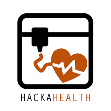

# HandTracking4Sohan 

## Challenges 

Sohan is 8 years old and even if he can't speak, he likes to communicate with the people around him by using pictograms and an eye-tracker detecting his gaze to select words on his computer and speak with people. 

To communicate, these technological devices require a high motor effort such as pressing on some button or concentrating his gaze on the computer screen for a long period of time. As a result, Sohan's ability to communicate with us is largely impaired. In this project, the goal was to design a controller that would allow him to communicate through his interface while requiring less physical effort from him. 

Sohan has cognitive impairments that do not allow him to control of his movements in general. Moreover he doesn't have the muscular strength to use a joystick or even to press keys on a keyboards or some buttons. He can only slide his left hand on the table and he has little control over his right hand. His head, very often, falls down on the left side of the body when he's tired. This makes very difficult to use eye-tracking device to detect the gaze to lead the computer interface. 

As the best way he has to communicate is through pictograms he points with the thumb on his left hand. So this is the best sensory input we can get from Sohan and we can use this as one of the inputs, so using simple computer vision techniques we can detect a color cue placed on his thumbs with a webcam and use the posiiton of the color cue to control a pointer on Sohan's computer. Also as a complement ot the mouse control we developped capacitive sensors to act as simple touch buttons to control the directional pad of the computer and navigate more easily on his interface and also activate the hand-tracking on a computer using the camera. 

 ## Files 
 - ```requirements.txt``` : Necessary libraries to run the project. 
  - ```Notes _ Ideas.docx``` : Ideas, notes and ressources for the challenge. 
  
 #### Webcam camera hand detection and tracking
 - ```test.py``` : Main hand segmentation code with OpenCV in Python, detects a specific shade of green in the webcam image and thresolds HSV values, then performs morphological operations to extract the contour of the detected green shape. Using this contour, it fixes a bounding box and its center. Using the center, it extracts the x and y position coordinates of the green shape and maps it to the screen to move the mouse. Need to se the ```lowerBound = np.array([29,86,6])``` and ```upperBound = np.array([64, 255, 255])``` HSV lower and upper thresholds to detect a different color. 
- ```test_trackerbar.py``` : Segmentation code with HSV trackerbar to select specific colors. 
- ```CameraInterface.py``` : Creates an command interface to select red, blue and green shapes seen by the webcam. Also creates two checkboxes ```Mouse``` to allow pointer control with the webcam and ```Clic``` to allow the user to use the webcam with two green markers on the fingers and actually clic on the computer by pulling the two fingers closer together. 
#### Capacitive touche sensor
- ```touch_detection.py```: Using capacitive sensors placed on a board, Sohan can slide his hand on the board and touchone of the capacitive sensors for some time to activate directonal keybord buttons and navigate through his computer interface. 
 
 ## Launch
- Launch the grid software and ```test.py```
- Focus on Python/Open-CV interface.
- Press ```a``` on keyboard to trigger right clic. 
- Now we should be are able to control the pointer with hand tracking. 
