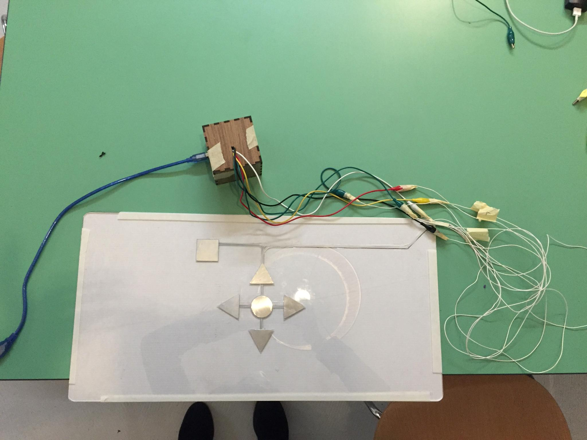
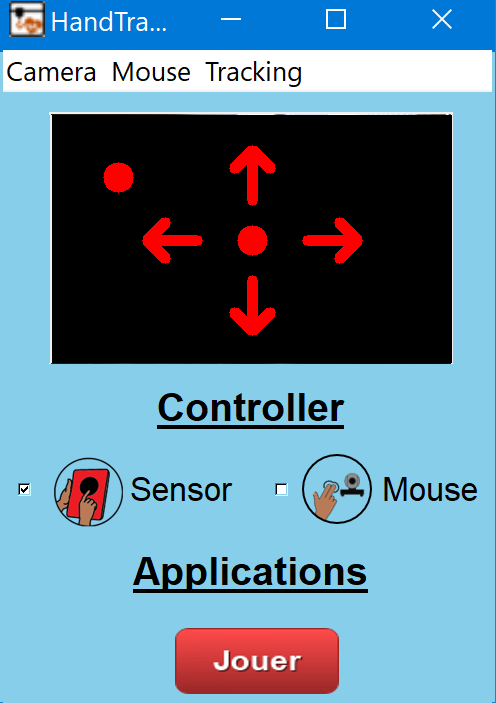
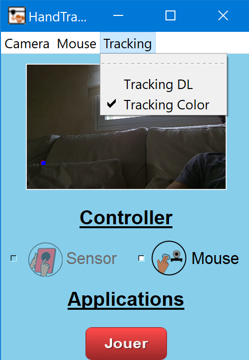
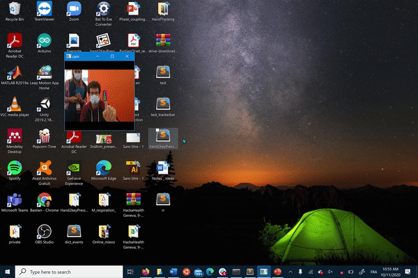

# HandTracking4Sohan

## Challenges 

Sohan is an 8 years old child that cannot speak. Thus, he needs to communicate to other people using devices such as a computer interface with eye tracking and pressing buttons. This communication was facilitated so far thanks to pictograms placed on the board in front of him and a computer with Grid3 software (https://thinksmartbox.com/product/grid-3/). This software provides a large vocabulary and numerous types of control (button, eye tracker,...)
However, most of the controllers proposed in Grid3 interfaces require a high motor effort. Because of this, his capacity of interaction with other people is largely impaired. In this project, the main goal is to design a controller that allows him to better communicate thanks to an efficient interface requiring less physical effort.  
Sohan has cognitive impairments that do not allow any control of his movements in general. Moreover, he cannot use fingers for pointing or typing or pressing buttons (no hand gestures). He can move only his left hand on the table. His head, very often, falls down on the left side of the body. This makes it very difficult to use eye-tracking devices to detect the gaze for leading the computer interface. 

## Brainstorming
List of the possible solutions: 
* Eye-tracker to detect the motion of his eyes; 
* Leap motion: a infrared camera to detect the motion of hands; 
* Capacitive sensors that can detect the contact (position, direction etc.) with some surfaces  of his left hand; 
* Hand tracking camera to detect the motion of his left hand via image processing and computer vision.   

## Chosen solution
We decided to combine 2 solutions using capacitive sensors and hand tracking camera to give both discrete (keyboards) and continuous control (mouse). 
The combination of the two solutions could even improve the precision of motor detection and decrease the physical effort, providing more precise and clear commands to use for better communication. 

1. Capacitive sensors: four arrows are displaced on the table (commands), indicating the four directions (up, down, right, left) plus another bottom in the middle (ok --> enter). We used conductor material(copper, aluminum) for the arrows to detect changes in electrical conductance when the person passes the hand over commands. The capacitive sensors are connected to an Arduino Uno that can process the signal to send to the computer interface allowing the navigation in Grid3 software. 

<p align="center"><p align="center">

2. Hand-tracking camera: the camera of the computer can detect the hand motion by sensors placed on the thumb and eventually on the index. The hand movement can be translated in the cursor position. Two methods can be used in the interface (HSV filter with a green patch on the hand, hand pose estimation). 

<p align="center"><p align="center">


## Files 
 - ```requirements.txt``` : Necessary libraries to run the project. 
 - ```CameraInterface.py``` : Interface to run 

 ## Launch
 
- Launch Grid3 software
- Run the command ```python CameraInterface.py```
Note: for the capacitive sensors, the interface needs to be maintained Active. 

#### Demo
##### Hand Tracking & Control of Grid Interface
<p align="center"><p align="center">

## Further improvements
...
