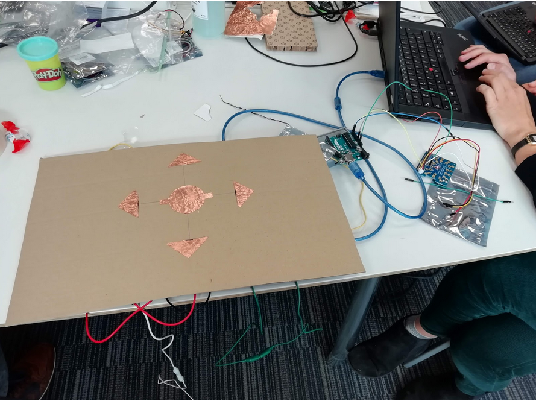
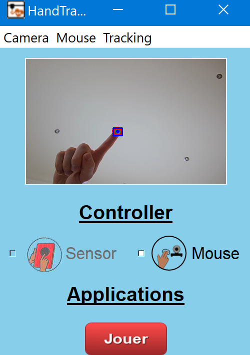
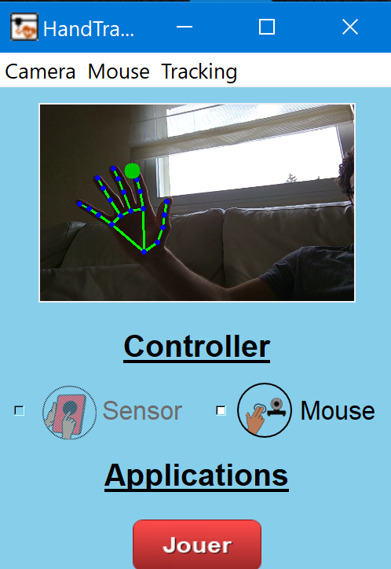

# HandTracking4Sohan

## Challenges 

Sohan is an 8 years old child that is unable to speak by himself. To facilitate the interaction with the people around him, he is using pictograms placed on the board in front of him and a computer with Grid3 software (https://thinksmartbox.com/product/grid-3/). This software provides him a large vocabulary and numerous types of control (button, eye tracker,...). However, most of these controllers require a high motor effort. Because of this, his capacity of interaction with other people is largely impaired. In this project, we designed a controller allowing him to better communicate thanks to an efficient interface with less physical effort.

## Brainstorming
Sohan has motor impairments that do not allow any control of his movements in general. He cannot use fingers for pointing or typing or pressing buttons (no hand gestures). He can move only his left hand on the table. His head, very often, falls down on the left side of the body. This makes it very difficult to use eye-tracking devices to detect the gaze for leading the computer interface. 

List of the possible solutions: 
* Eye-tracker to detect the motion of his eyes 
* Leap motion: a infrared camera to detect the motion of hands 
* Capacitive sensors that can detect the contact (position, direction etc.) with some surfaces  of his left hand
* Hand tracking camera to detect the motion of his left hand via image processing and computer vision.   

## Chosen solution
We designed an interface combining 2 solutions using capacitive sensors and hand tracking camera to give both discrete (keyboards) and continuous control (mouse). 
By combining these two solutions, the goal was to decrease the physical effort, providing more precise and clear commands to use for better communication. 

<p align="center"><p align="center">

1. Capacitive sensors: Four arrows are displaced on the table (commands), indicating the four directions (up, down, right, left) plus another bottom in the middle (ok --> enter). In the first prototype (left), we used conductor material(copper, aluminum) for the arrows to detect changes in electrical conductance when the person passes the hand over commands. The capacitive sensors are connected to an Arduino Uno that can process the signal to send to the computer interface allowing the navigation in Grid3 software.In the second prototype (right), the copper was replaced with aluminium and the cardboard with plexiglass.

<p align="center"><p align="center">

2. Hand-tracking camera: the camera of the computer can detect the hand motion by sensors placed on the thumb and eventually on the index. The hand movement can be translated in the cursor position. Two methods can be used in the interface: HSV filter with a green patch on the hand (left picture) or hand pose estimation (right picture). This solution can be activated by Sohan by touching the left top buttons which play the rol of switch for controllers. 

<p align="center"><p align="center">

## Setup the interface 
 - ```pip install -r requirements.txt``` to install all the dependencies

 ## Launch
 
- Launch Grid3 software
- Run the command ```python CameraInterface.py```
Note: for the capacitive sensors, the interface needs to be maintained Active. 

## Demo
### Hand Tracking & Control of Grid Interface
<p align="center"><p align="center">

## Contact 
For any questions,please contact HackaHealth on our website https://www.hackahealth.ch/ 
